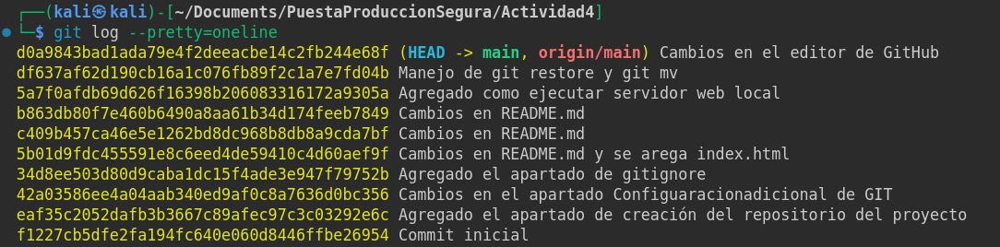

# Actividad 4ra5. Git (II)

1. [Configuración adicional de GIT](#configuración-adicional-de-git)
2. [Creación repositorio del proyecto](#creación-repositorio-del-proyecto)
3. [Ignorar ficheros con gitignore](#ignorar-ficheros-con-gitignore)
4. [Trabajo con Git](#trabajo-con-git)
5. [Servidor web local](#servidor-web-local)
6. [Más cambios con Git](#más-cambios-con-git)
7. [Uso de git log](#uso-de-git-log)
8. [Ramas](#ramas)


## Configuración adicional de GIT
1. Configuramos el editor por defecto con el comando `git config --global core.editor codium`, en mi caso estoy indicando que el editor sea [VSCodium](https://vscodium.com/).
2. Configuramos tambien que nos muestre los mensajes directamente sin necesidad de entrar en el editor al usar los comandos `git diff` o `git log` con el comando `git config --global core.pager`.
3. Utilizamos el comando `git config -l` para comprobar que se ha aplicado la configuración anterior.

4. Podemos ajustar los colores de diversos datos con los siguientes comandos:
```
color.status=auto
color.branch=auto
color.interactive=auto
color.diff=auto
```

## Creación repositorio del proyecto
En nuestro equipo ejecutamos `git init` en la carpeta donde estamos desarollando este manual. Y creamos el primer coomit.
Accedemos a [GitHub](#https://github.com) y creamos un nuevo repositorio público con el nombre PPS-Unidad0Actividad4-AdrianCurtoSanchez.


Copiamos y pegamos en la terminal los comandos de agregar el repositorio ya existente.

```
git remote add origin git@github.com:Acurtos01/PPS-Unidad0Actividad4-AdrianCurtoSanchez.git
git branch -M main
git push -u origin main
```


## Ignorar ficheros con gitignore
Cremos el directorio *excluided* y el fichero excluido.txt.


Como se puede apreciar en la captura anterior git nos está indicando que hay dos nuevos elementos. Ahora creamos el fichero .gitignore e introducimos lo siguiente dentro de el para evitar que git continue realizando el siguimiento del direcotrio y el fichero creado anteriormente:
```
/excluded
*.txt
```
Ahora podemos observar que han sido excluidos del seguimiento.


## Trabajo con Git

Creamos un fichero en nuestro proyecto con el nombre index.html, el cual contendrá el siguiente código:
```
<H1>Hola $USER¡¡¡ ¿Qué tal te encuentras?</H1>
```

Una vez creado el fichero con su contenido podemos obtener una pequeña ayuda de git con el comando `git status -s`el cual con el parámetro *-s* nos devolverá una salida abrebiada.


En la salida anterior podemos observar que el fichero README.md ha sido modificado e index.html se encuentra en estado sin seguimiento.

Para crear un commit con estos cambios ejecutaremos el comando `git commit -am "mensaje del commit"`, el parámetro *a* indica que se agregen todos los ficheros rastreados y el parámetro m permite especificar el mensaje del commit.


Volvemos a ejecutar el comando `git status -s` y esta vez no nosmuestra ningún fichero, podemos estar seguros de que nuestros ambios están guadados y podemos realizar la subida al repositorio remoto con `git push`.


## Servidor web local

Para visualizar los cambios en el fichero index.html en local podemos ejecutar un servicio php con el comando `php -S 0:8080`en el directior actual del proyecto.


Ahora en el navegador podemos acceder a http://localhost:8080 y podremos observar el contenido de index.html.


## Más cambios con Git

Creamos una copia de index.html con nombre index.html.save.


Ahora que tenemos una copia implemetaremos cambios en el fichero index.html y al refrescar la página en el navegador veremos los cabios aplicados.


Ahora si verificamos el estado del proyecto con `git status` veremos los ficheros nuevos que aún no estan en seguimiento y los ficheros con cambios. Tambien nos da sugerencias de que hacer con esos ficheros.


Con el comando `git diff`podemos revisar los ficheros con cambios en el proyecto.


Para volver a la versión anterior de index.html empleamos el comando `git restore index.html`, tras este cambio si refrescamos el navegador veremos el fichero a vuelto al estado anterior.


Otra alternativa al paso anerior es el empleo del comando `git mv index.html.save index.html` idicamos que el contenido de index.html.save pase a index.html.


Para poder ejecutar el comando anerior el ficheros origen debe estar bajo seguimiento, sino nos dará un error como se aprecia en la captura anterior. Añadimos el fichero index.html.save al seguimiento y borramos el fichero index.html ya que el comando `git mv` lo que hace el mover ficheros o renombralos.


Comprobamos los cambios de nuevo con `git status` donde podemos apreciar que index.html no ha sufrido cambios pese a haber estado trasteando con el.


Confirmamos los cambios realizados con un commit y subimos los cambios al repositorio.

Revisamos que los cambios han sido aplicados en el repositorio de GitHub.


Se observa que los los últimos cambios en los ficheros son recientes. Ahora modificaremos index.html desde el propio repositorio remoto de Github. Para ello accedemos al fichero en cuestión y arriba a la derecha pulsamos el botón con el icono de un lapiz.


Añadimos los cambios y tras ello hacemos clic en *Commit changes...*


Confirmamos el mensaje del commit en el modal y clicamos en *Commit changes*.


Si nos traemos los cambios realizados con `git pull` y refrescamos el navegador veremos el cambio realizado en index.html


## Uso de git log

Podemos observar todos los cambios realizados hasta ahora con el comando git log.


También podemos limitar el número de commits mostrados, para ello añadiremos como parámetro el numero de commits deseados, por ejemplo para mostrar los últimos 3 commit usamos el comando `git log -3`.


Tenemos la opción de añadir el modificador `--prety` para visionar los datos de una forma más amigable, esta tiene varios parámetros disponibles para mostrar la información en este caso se usará el parámetro `oneline`que muestra los commits en una sola línea.




Podemos indicar que miestre las diferencias en los ficheros de cada commit con el parámetro `-p`, mostraremos las diferencias de los dos últimos commits con el comando `git log -p -2`.


Otra opción interesante es el empleo de mostrar los commits por fechas con el uso de pretty `--since`, mostraremos los commit del último día como ejemplo con el comando `git log --since=1.day`.


Se puede ver como solo muestra los datos del último día.


## Ramas

Con el comando `git branch --list` o `git branch` podemos listar las ramas del reositorio.


Podemos crear una rama nueva y situarnos en ella con el comando `git checkout -b Vers1`.


Aplicamos modificaciones en index.html sobre esta nueva rama.


Subimos los cambios de la rama con el comando `git push origin Vers1`.


Para ver las diferencias entre las ramas usamos el comando `git diff main Vers1 --name-only` con el modificador `--name-only` nos mostrará solo los nombres de los ficheros con diferencias.

